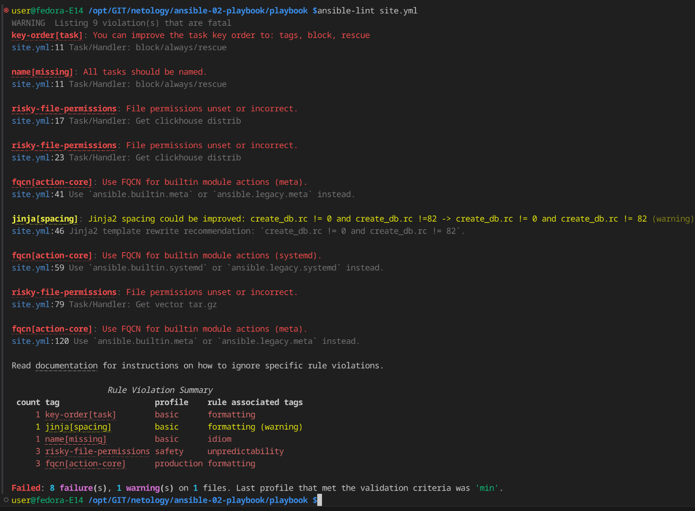

# Домашнее задание к занятию 2 «Работа с Playbook»

## Описание плэйбука
Данный playbook выполняет развертывание ClickHouse и Vector на хосты под управлением CentOS7/Fedora

В инвентори файле ./inventory/prod.yml добавлены необходимые хосты

### Версия

Пакеты
**Clickhouse v.24.9.3.128**
**Vector v.0.42.0**

### Файлы конфигурации vector
Во время выполнения плэйбука для vector копируются шаблон файла конфигурации и службы с нужными переменными, необходимыми для функционирования приложения.

В папке ./template находятся jinja2 файлы необходимых конфигураций

Переменные располагаются в ./vector/vars.yml

Файл конфигурации копируется в /etc/vector/vector.yaml

Сервис создается в /etc/systemd/system/vector.service

Бинарный файл veсtor копируется в /usr/bin/

### Пункт 5

Проверка **ansible-lint**

После исправления ошибок

### Пункт 6

При запуске плэйбука с флагом **--check**, выполняется имитацию запуска роли на хост.
Так как в сценарии есть задача создания директорий, и обращение к ним в дальнейшем, запуск завершится с ошибкой, поскольку при тестовом запуске директории не создаются.

###  Пункт 7

При запуске плэйбука с флагом **--diff**
происходит вывод информации изменений - начальное состояние - целевое состояние

### Пункт 8

При повторном запуске плэйбука с флагом **--diff** никаких изменений не вносится. 

## Итог
[Финальный код (ссылка на репозиторий)](https://github.com/5793409/netology/blob/main/ansible-02-playbook/README.md)