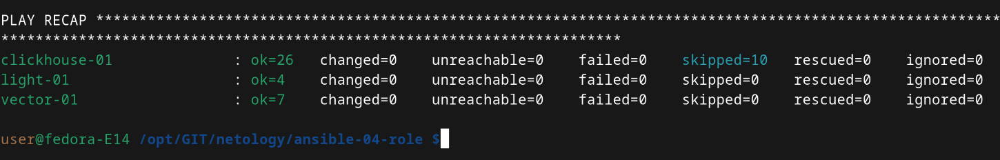

# Домашнее задание к занятию 4 «Работа с roles»

## Описание
Данный playbook выполняет установку Clickhouse, Lighthouse, Vector:

При помощи ansible-galaxy скачиваются роли указанные в requirements.yml из github, 

## Итог

[Репозиторий Vector](https://github.com/5793409/vector-role)

[Репозиторий LightHouse](https://github.com/5793409/lighthouse-role)

[Финальный код (ссылка на репозиторий)](https://github.com/5793409/netology/blob/08-ansible-04-role/ansible-04-role/)
